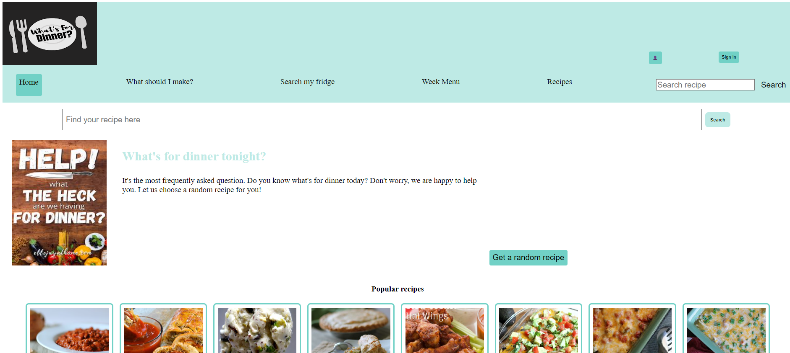

# What's for dinner?

## Inhoudsopgave
<!-- TOC -->
  * [1. Inleiding](#1-inleiding)
  * [2. Ontwikkeld met](#2-ontwikkeld-met)
  * [3. Aan de slag](#3-aan-de-slag)
    * [3.1 Vereisten](#31-vereisten)
    * [3.2 Installatie](#32-installatie)
  * [4. De applicatie starten](#4-de-applicatie-starten)
<!-- TOC -->

## 1. Inleiding

Iedereen heeft er wel eens last van. Geen inspiratie voor het avondeten of het weekmenu. Daarnaast is het ook altijd
weer zoeken naar gerechten op basis van ingrediënten die je nog in huis hebt. Of je wilt gewoon inspiratie opdoen.

Hoe dan ook, het blijft een van de meest gestelde vragen: "Wat eten we vandaag?". Van het opzoeken van recepten op basis
van ingrediënten tot het browsen van alle recepten. In deze applicatie kan het allemaal.

## 2. Ontwikkeld met
* React.js
* Spoonacular API
* NOVI educational Backend

## 3. Aan de slag

### 3.1 Vereisten
* Webstorm (of een andere IDE)
* node.js
* npm
* API-key van Spoonacular

### 3.2 Installatie
1. **Installeer Webstorm**
 Om de applicatie te kunnen draaien dient u een IDE te hebben. U kunt hiervoor WebStrom gebruiken of een andere IDE gebruiken.
WebStorm kunt u [hier](https://www.jetbrains.com/webstorm/download/#section=windows) downloaden.
  
2.  **Installeer node.js**
     Node.js kunt u [hier](https://nodejs.org/en/download/current/) downloaden.
    Na het downloaden en installeren kunt u met `npm -v` controleren of de installatie succesvol is verlopen.
    Mogelijk moet u eerst de IDE opnieuw opstarten.
      
3. **Installeer npm**  
   Om gebruik te kunnen maken van de applicatie heeft u npm nodig. 
   Installeer de laatste versie van npm door het commando `npm install npm@latest -g` in uw terminal te runnen.
     
4. **Clone de repository** 
`git clone https://github.com/SDominguezDominguez/Whats-for-dinner`
     
5. **Installeer de npm packages** 
    Nadat het project gecloned is naar uw locale computer, moeten eerst de node_modules geïnstalleerd worden.
    Dit kunt u doen door `npm install` in uw terminal te runnen.
     
6. **API key verkrijgen**  
   Voor het ophalen van de data heeft u een API key nodig van Spoonacular. Deze kunt u gratis op Spoonacular verkrijgen 
   Vraag een API key aan bij [Spoonacular](https://spoonacular.com/food-api/console#Dashboard) of gebruik de API key uit het aangeleverde document Functionele Ontwerp.
     
7. **De API key toevoegen aan het project** 
    - Maak een .env file aan
    - Voeg de volgende code toe aan de .env file: ` REACT_APP_API_KEY=***************` 
      Vervang hierbij de * met de API key
    
## 4. De applicatie starten

1. Wanneer de installatie stappen doorlopen zijn, kunt u de applicatie starten met behulp van: 
        `npm run start`
  
2. Open http://localhost:3000 om de pagina in de browser te bekijken.  
    Elke keer dat u een bestand opslaat, zullen de wijzigingen te zien zijn op de webpagina.
